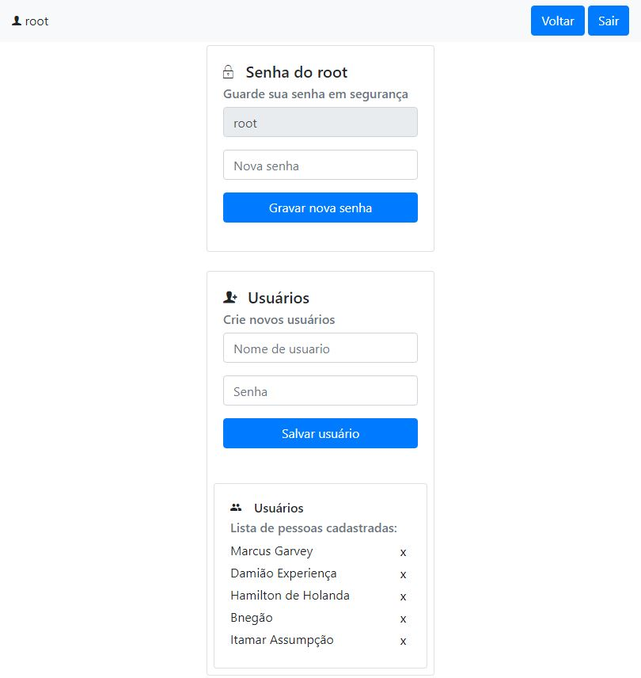

# simple-auth

## Description

This is a small backend project to exercise a auth approach that uses express, express-session, mongodb, mongoose, bootstrap, bcrypt and ejs.



## Getting Started

### Dependencies

```
    "bcrypt": "^5.0.1",
    "body-parser": "^1.19.0",
    "ejs": "^3.1.6",
    "express": "^4.17.1",
    "express-session": "^1.17.2",
    "mongoose": "^6.0.11"
```

### Installing

* Download, install and run [NoSQLBooster for MongoDB](https://nosqlbooster.com/downloads)
* Clone this project
```
git clone https://github.com/johnsonsudre/simple-auth.git
npm install
```

### Executing program

```
npm start
```

## Help

Feel free to download, change, send issues and pull request

## Authors

Contributors names and contact info

[johnsonsudre](https://github.com/johnsonsudre/)


## License

This project is licensed under the MIT License.

## Acknowledgments

Inspiration, code snippets, etc.
* [Curso DevPleno](https://go.devpleno.com/fsm)